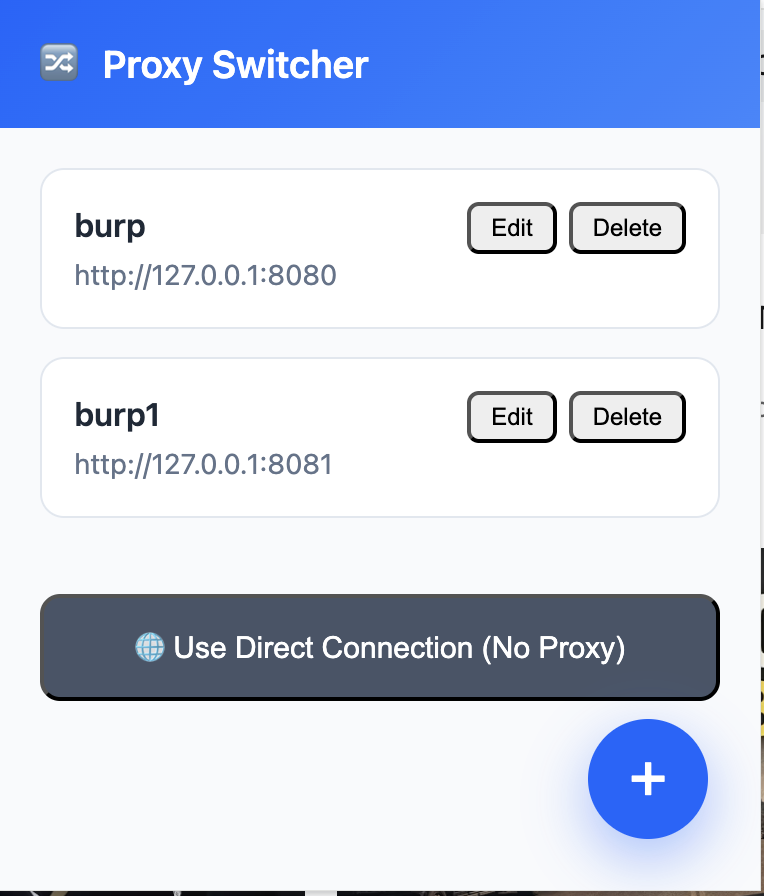

### Proxy Setup

- Install Burp
- Download CA cert.
    - Turn on burp proxy. Visit http://127.0.0.1:8080
    - Click CA Cert
- Go to chrome's privacy & security section and then manage certificates. import the downloaded cert.
- Select the configured proxy on the plugin.
    - Proxy Address: 127.0.0.1
    - Proxy Port: 8080
    - Proxy Protocol: htt:p
- Verify traffic geting proxied to burp.

 

### Code Walkthrough

- https://claude.ai/share/8701580c-ec3f-4a36-ad21-25a8ef19c1ff

